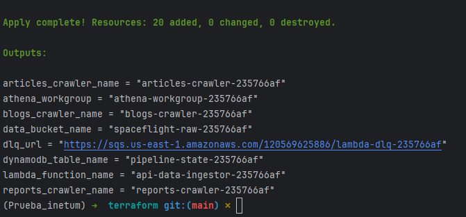
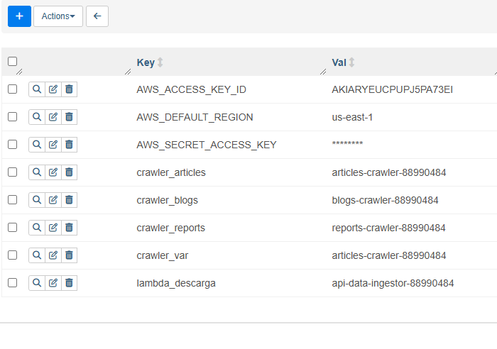
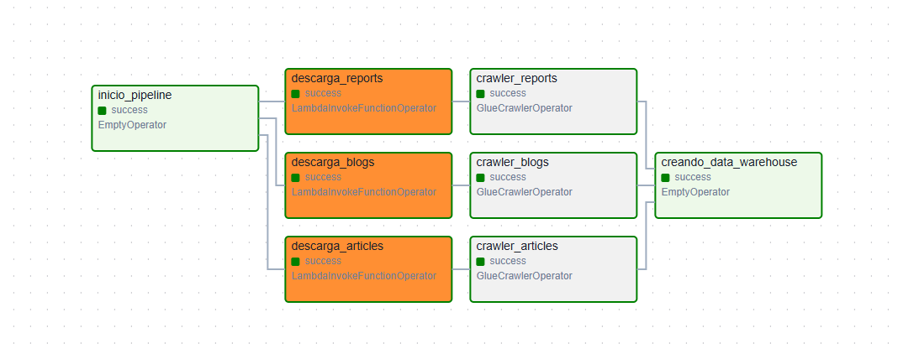
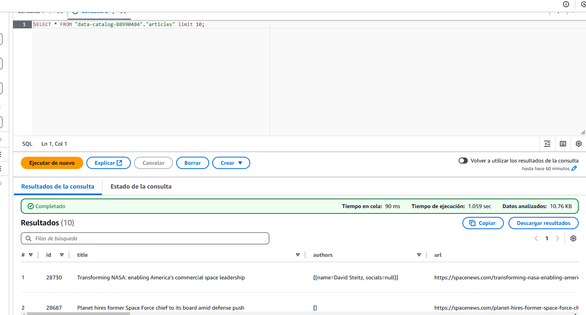

### 🔧 Herramientas Obligatorias
- **Terraform**  ([Instalación](https://developer.hashicorp.com/terraform/tutorials/aws-get-started/install-cli))
- **Docker**  ([Guía de instalación](https://docs.docker.com/engine/install/ubuntu/))
- **AWS CLI**  ([Configuración](https://docs.aws.amazon.com/cli/latest/userguide/getting-started-install.html))
- **WSL2** con Ubuntu 22.04 LTS
- Cuenta AWS con permisos de **Administrador**

### Despliegue de Infraestructura

1. Ejecutar Terraform:
    ```bash
    cd infrastructure/terraform
    terraform init
    terraform apply
    ```
    Esto instalará todos los componentes necesarios en AWS.

    

### Configuración de Airflow

1. Iniciar Entorno:
    ```bash
    cd ../../airflow
    docker compose up 
    ```
    Esto levanta un Docker con Airflow y todos sus componentes. Las claves y usuario son **airflow**, la url de la interfaz de Airflow es [http://localhost:8080/](http://localhost:8080/).

2. Configurar Variables:
    En la interfaz de Airflow, vamos al apartado de variables y agregamos `AWS_ACCESS_KEY_ID`, `AWS_SECRET_ACCESS_KEY`, `AWS_DEFAULT_REGION`, así como las variables de los componentes creados con Airflow, como el nombre de la función Lambda y los nombres de los Glue Crawlers.

    

3. DAG de Airflow:
    Este es el gráfico del DAG el cual tiene los pasos de ejecución. Se puede ver que la descarga se realiza en paralelo y luego se infieren los datos con Glue Crawler.

    

4. Consulta de Datos con Athena:
    Estos datos se envían a un catálogo y se pueden leer con Athena, el cual tiene una enorme ventaja en términos de costos.

    

5. Análisis y Dashboards:
    Estando los datos en Athena, ya podemos comenzar a profundizar los análisis o crear dashboards en Quicksight fácilmente.